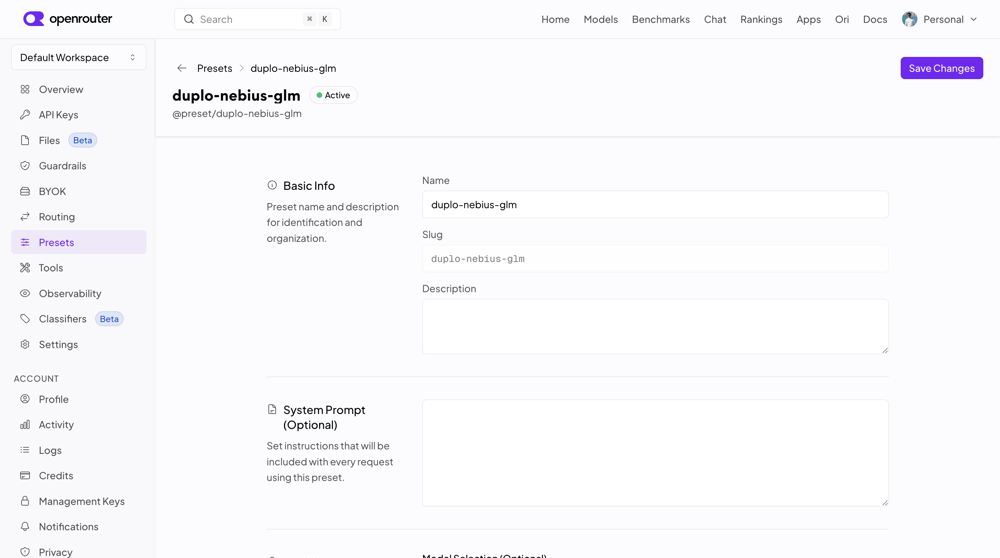
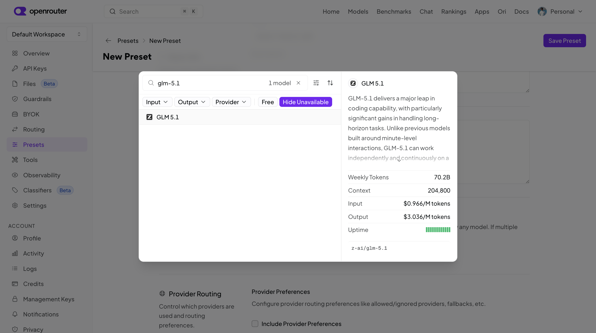
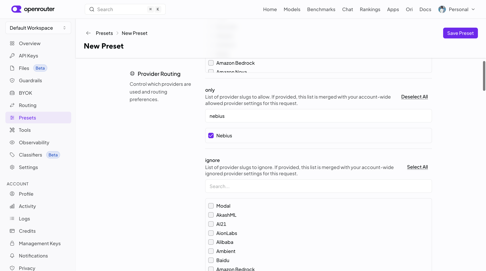
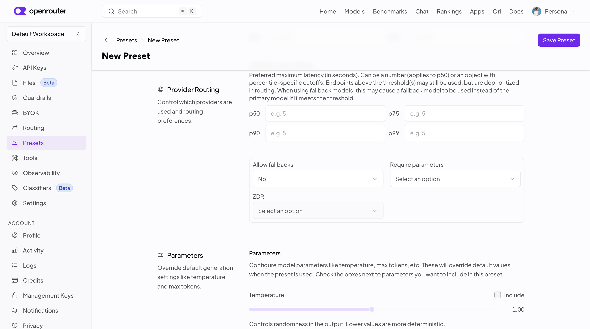
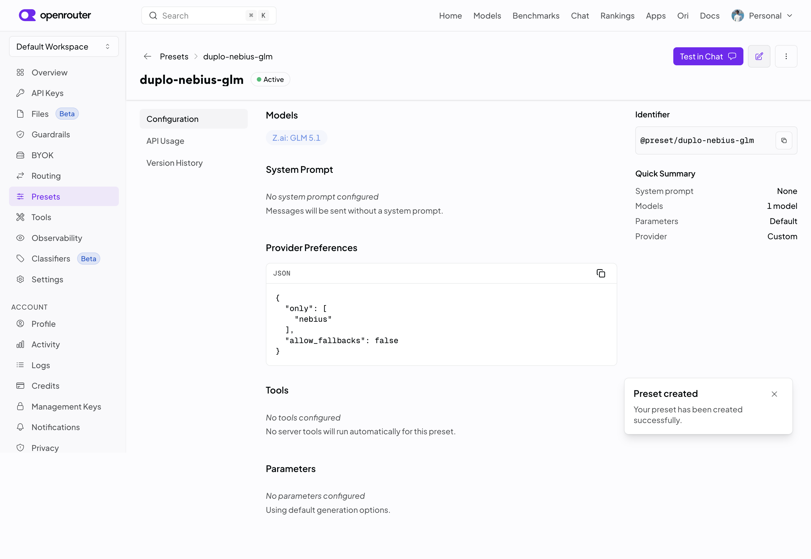

# Sponsor Integrations

Wire a sponsor tool into your agent. **Pick one and follow it top to bottom.**

| Sponsor | What you get | Time |
| --- | --- | --- |
| **[Neo4j](#neo4j)** | Agent queries a graph database | ~15 min |
| **[Crusoe / Nebius](#crusoe--nebius-via-openrouter)** | Agent runs on their GPUs via OpenRouter | ~10 min |
| **[Vultr](#vultr)** | Agent calls the Vultr API | ~10 min |

Prerequisite: platform running — [Installing DevKit.md](<Installing DevKit.md>).

> **Prize note:** every tool you connect must *do something* in your project. Plugged in and idle doesn't count.

---

## Neo4j

The agent talks to the graph through the `mcp-neo4j-cypher` MCP server.

### Get a graph first

1. [console.neo4j.io](https://console.neo4j.io) → sign up
2. **New Instance** → **AuraDB Free**
3. Name it, pick a region, **Create**
4. **Click "Download to continue" immediately** — the password is shown once and cannot be recovered
5. From **Connection details**, collect:

| Value | Example |
| --- | --- |
| `uri` | `neo4j+s://<instance-id>.databases.neo4j.io` |
| `username` | `neo4j` |
| `password` | from the downloaded file |
| `database` | `neo4j` |

### 1. Register the MCP server

**AI Admin → MCP Servers → Add**

| Field | Value |
| --- | --- |
| Name | `neo4j-mcp` |
| Provider Type | **`Other`** → type `other` in the text box |
| Config Type | **`Raw`** |

```json
{
  "mcpServers": {
    "neo4j": {
      "command": "/usr/local/bin/mcp-neo4j-cypher",
      "args": [],
      "env": {
        "NEO4J_URI": "${credential.uri}",
        "NEO4J_USERNAME": "${credential.username}",
        "NEO4J_PASSWORD": "${credential.password}",
        "NEO4J_DATABASE": "${credential.database}",
        "NEO4J_TRANSPORT": "stdio",
        "NEO4J_SCHEMA_SAMPLE_SIZE": "1000",
        "MCP_TIMEOUT": "7000"
      }
    }
  }
}
```

**Create.**


### 2. Create the provider

**Providers → IT → Other → Add**

| Field | Value |
| --- | --- |
| Name | `neo4j-mcp` |
| Type | `Other` |
| Account ID | your `uri` |

**Next.**


### 3. Add credentials

Name it `neo4j-credentials`, then add four fields — **names must match the `${credential.*}` keys exactly, lowercase:**

`uri` · `username` · `password` · `database`

Leave Type `String` and Sensitive on. **Next.**


### 4. Create the scope — **skip the wizard step**

On the Scope page, select both the Neo4j credential and the MCP server.

| Field | Value |
| --- | --- |
| Name | `neo4j-mcp-scope` |
| Credential | `neo4j-credentials` |
| MCP Server | `neo4j-mcp` |


<details>
<summary>Got <code>provider type '' does not match</code>?</summary>

You left Provider Type blank in step 1. **AI Admin → MCP Servers → neo4j-mcp → Edit** → set Provider Type to `Other` and type `other` in the box. Retry Add Scope.


</details>

### 5. Attach to a workspace

From the **Scope Created** prompt (or Scope tab → row menu), pick your workspace → **Attach**.


### 6. Enable on a ticket

In the top navigation, switch to AI DevOps.

Attaching makes it *available*, not active. When creating a ticket, open **Select Scopes** and pick `neo4j-mcp-scope`.

### 7. Verify

> What schema do you see in neo4j?

The agent should discover and call `get_neo4j_schema` / `read-neo4j-cypher`.


The agent can now read and write Neo4j data.

---

## Crusoe / Nebius (via OpenRouter)

Run the agent's model on Crusoe or Nebius GPUs. OpenRouter fronts both providers; a **preset**
pins your requests to the one you picked. No code changes — the dev kit already speaks to any
Anthropic-compatible gateway.

### 1. OpenRouter account

1. Sign up at [openrouter.ai](https://openrouter.ai)
2. Left sidebar → **Credits** → add credits ($10 is plenty for Hack Day)
3. Left sidebar → **API Keys** → create one. **Copy it now** (`sk-or-v1-…`) — shown once

### 2. Create a preset per provider

Without a preset, OpenRouter routes each request to *any* provider serving that model — your
"Nebius" traffic can silently land on Alibaba. The preset is the pin.

Left sidebar → **Presets** → **New Preset**. The form is long; you touch exactly **three
sections** and leave everything else blank:

1. **Basic Info → Name** — name it for the pairing, e.g. `duplo-nebius-glm`. The **Slug**
   auto-fills; that slug is your model string later: `@preset/duplo-nebius-glm`

   

2. **Models → Add model** — search your model (e.g. `glm-5.1`) and click the match. The panel on
   the right shows the canonical id (`z-ai/glm-5.1`) and its **Context** size — note that number,
   step 4 needs it.
   - The model **must support tool calling**, or the agent can never call a tool — filter on
     [openrouter.ai/models](https://openrouter.ai/models?supported_parameters=tools)
   - Skip `:free` variants
   - Watch near-duplicates (Instruct vs Thinking editions) — the right panel's id is the truth

   

3. **Provider Routing** — check **Include Provider Preferences**, then two settings inside it:
   - Scroll to the checklist titled **`only`**. There are three look-alike provider checklists
     (`order`, `only`, `ignore`) — **`only`** ("provider slugs to allow") is the one that pins.
     Search your provider (`nebius` / `crusoe`) and tick it.

     

   - Keep scrolling to **Allow fallbacks** → **No**. Left on Yes, a busy provider is silently
     swapped out and your pin is meaningless.

     

4. **Save Preset** (top right). The preset page must show, under **Provider Preferences**:

   ```json
   { "only": ["nebius"], "allow_fallbacks": false }
   ```

   

**Touch nothing else.** Every value set in a preset (system prompt, temperature, max tokens)
silently overrides *every* request the agent makes — a max-tokens here becomes a hard ceiling
on agent output.

**Validated pairings** (each verified end-to-end through the dev kit):

| Preset | Model | Provider (`only`) | Context |
| --- | --- | --- | --- |
| `duplo-nebius-glm` | `z-ai/glm-5.1` | nebius | 204800 |
| `duplo-nebius-qwen` | `qwen/qwen3-235b-a22b-2507` | nebius | 262144 |
| `duplo-crusoe-glm` | `z-ai/glm-5.3` | crusoe | 1310720 |
| `duplo-crusoe-kimi` | `moonshotai/kimi-k2.6` | crusoe | 262144 |

### 3. Confirm the pin

Ten seconds now saves an hour later — a mis-pinned preset looks exactly like a dev-kit bug.

```bash
curl -s https://openrouter.ai/api/v1/messages \
  -H "content-type: application/json" \
  -H "authorization: Bearer sk-or-v1-..." \
  -H "anthropic-version: 2023-06-01" \
  -d '{"model":"@preset/duplo-nebius-glm","max_tokens":50,
       "messages":[{"role":"user","content":"Say only OK"}]}'
```

Look for `"provider"` matching what you pinned.

| Result | Cause |
| --- | --- |
| Wrong provider | Model string isn't `@preset/<slug>`, or Allow fallbacks is still Yes |
| Error mentioning no allowed providers | The provider ticked under `only` doesn't serve that model |
| `rate_limit_exceeded` / `upstream_provider_shared_pool` | Provider saturated — retry, switch model, or go BYOK |

### 4. Point the agent at it

Use the model's **Context** number from step 2 (or the pairings table) — the CLI assumes 200K
for model ids it doesn't recognize, and if the real window is smaller the session hard-fails
mid-run instead of compacting. Keep the compact window a bit under it.

**Haven't run `./run.sh` yet?** Start on OpenRouter directly — pick option `3` (LLM gateway)
at the provider prompt, or skip every prompt with flags:

```bash
./run.sh --model gateway \
  --gateway-url https://openrouter.ai/api \
  --gateway-token sk-or-v1-... \
  --gateway-model @preset/duplo-nebius-glm \
  --gateway-max-context-tokens 204800 \
  --gateway-compact-window 160000
```

**Already running on `anthropic` or `bedrock`?** That's the normal case — don't start over.
This re-points the same platform at OpenRouter; your existing keys are stashed in `.env`, so
`./scripts/switch-llm.sh anthropic` (or `bedrock`) switches back later without re-entering
anything:

```bash
./scripts/switch-llm.sh gateway \
  --gateway-url https://openrouter.ai/api \
  --gateway-token sk-or-v1-... \
  --gateway-model @preset/duplo-nebius-glm \
  --gateway-max-context-tokens 204800 \
  --gateway-compact-window 160000
```

**Verify:** `./scripts/switch-llm.sh status` prints `Active provider: gateway`. In the UI,
create a ticket — the LLM picker offers your preset (e.g. `@preset/duplo-nebius-glm
(LLM Gateway)`) — and the agent's reply on that ticket is served by your pinned provider.

---

## Vultr

Give the agent Vultr credentials and it can manage every aspect of your Vultr account.

### 1. Get an API key

Sign up and **add a payment method** — API access stays disabled until the account is validated with a minimum charge.

1. Account name (top-right) → **Manage User**

   

2. Left nav → **Access → API Access**
3. If disabled, click **Enable API Access**

   

4. **Copy the key from the popup** — shown in full only once

### 2. Create provider + credential + scope

**Administration → Providers → IT → Other → Add** — one wizard does all three.

**Provider:**

| Field | Value |
| --- | --- |
| Name | `vultr` |
| Type | `Other` |
| Account ID | `https://api.vultr.com/v2` |
| Description | paste the curl from step 3 — **this text goes into the agent's system prompt**, and is the only way to teach it the call without a code change |

**Credential:**

| Field | Value |
| --- | --- |
| Name | `vultr` |
| Key | **`apikey`** — lowercase, type Secret, Sensitive on |
| Value | your key |


**Scope:** name it `vultr`, leave **MCP Server empty**. Save, then attach to your workspace.

### 3. Verify


Create a ticket asking the agent to list your Vultr instances and VPCs. On a new account both lists come back empty, but that still confirms authentication worked.


---

## Pattern for any other sponsor

Every integration above is the same four things:

1. **Provider** — `Other` type, Account ID = the API base URL
2. **Credential** — lowercase keys, Sensitive on
3. **Scope** — MCP Server set (MCP tools) or empty (plain REST)
4. **Attach to workspace**, then **enable on the ticket**

So: does the sponsor ship an MCP server? Set it on the scope. Otherwise it's a REST API.

**Stuck?** See [Getting Support.md](<Getting Support.md>).
